# EyeHero

#### Video Demo: <https://youtu.be/fI4Lm0z02SY>

#### Description
EyeHero is a web application designed to promote **healthy screen habits** and prevent **digital eye strain**. Inspired by my personal journey with weak eyesight and LASIK surgery, I built this app as my CS50x Final Project to help others protect their eyes while working or studying.

The app follows the **20-20-20 Rule**, guides users through **morning and night exercises**, and tracks daily consistency using a **calendar + streak system**. It also uses **avatars** (EyeHero, Tired, Happy) that change dynamically to keep the experience fun and interactive.

---

## Features

### 👩‍💻 User Authentication
- Secure **signup, login, and logout** system.
- Password recovery through a **security question** (CS50 scope-friendly, no external email integration).

### ⏰ 20-20-20 Rule (rule.html)
- Reminds users every 20 minutes to take a **20-second break** and look 20 feet away.
- Includes **browser notifications**.
- Avatars change dynamically:
  - **EyeHero (default)** → during normal work.
  - **Tired (tired.png)** → when it's break time.
  - **EyeHero back** → after break ends, ready to work again.

### 🌞 Morning & 🌙 Night Exercises
- **morning_exercise.html** → energizing exercises like eye rolling, near-far focus, blinking, palming, and neck/shoulder stretches.
- **night_exercise.html** → calming exercises like palming, massage, slow blinking, and figure-8 to relax before sleep.
- Each exercise includes:
  - **Step-by-step instructions with timers**.
  - **Beep sound** at timer completion.
  - **Next button** to move forward.
- At the end:
  - Avatar changes to **Happy (happy.png)** with a congratulatory message.
  - A **Finish button** appears which saves progress into the database.

### 📅 Progress Tracking (progress.html)
- **Calendar view** shows monthly exercise history.
- **Color-coded days:**
  - 🟩 Green → Morning ✅ + Night ✅ done.
  - 🟥 Red → Missed either morning or night.
  - ⚪ Gray → Not attempted.
- **Tooltips** on hover show detailed status (Morning/Night).
- **Streak counter** displays current streak in days.

### 🎨 Motivational Avatars
- `eyehero.png` → default state.
- `tired.png` → during breaks.
- `happy.png` → after finishing exercises successfully.

### 🔔 Push Notifications
- Browser notifications powered via Node.js push server.
- Service worker `sw.js` handles notifications in the browser.
- Requires Node.js push server running in parallel with Flask backend.

---

## File Structure
```
eyehero/
├── app.py                      # Main Flask application (routes, DB connections, backend logic)
├── requirements.txt            # Python dependencies list (Flask, SQLite, etc.)
├── README.md                   # Project overview, setup guide, and usage instructions
├── templates/
│   ├── frontpage.html          # Landing page with intro
│   ├── login.html              # Login form
│   ├── signup.html             # Signup form
│   ├── forget_password.html    # Reset password with security question
│   ├── home.html               # User dashboard
│   ├── rule.html               # 20-20-20 timer
│   ├── exercise.html           # Exercise entry page
│   ├── morning_exercise.html   # Morning routine
│   ├── night_exercise.html     # Night routine
│   ├── progress.html           # Calendar + streak tracker
│   └── layout.html             # Base layout
├── static/
│   ├── css/
│   │   ├── landing.css         # Styles for landing/front page
│   │   ├── home.css            # Styles for user dashboard
│   │   ├── progress.css        # Styles for progress tracker
│   │   └── styles.css          # Global/common styles shared across pages
│   ├── js/
│   │   ├── script.js           # Timer, notifications, rule logic
│   │   └── exercises.js        # Exercise instructions, timers, finish logic
│   │   └── sw.js               # Service Worker for push notifications
│   │       # Handles subscription, notification display, and interaction
│   ├── images/
│   │   ├── background.png       # Background image
│   │   ├── eyehero.png          # Main EyeHero avatar
│   │   ├── icon.png             # Favicon / browser tab icon for the website
│   │   ├── happy.png            # Happy avatar (feedback after exercises)
│   │   └── tired.png            # Tired avatar (before exercise reminder)
│   └── sound/
│       └── beep.mp3             # Beep sound for timer alerts/notifications
│   └── server/
│       └── app.js               # Node.js push server
│           # Handles push subscriptions, sending notifications, Express API
└── db/
    └── eyehero.db              # SQLite database (users + progress + push_subscriptions)
```
---

## How It Works

1. **User Flow**
   - Users land on the frontpage and sign up.
   - Logs in and is redirected to the home dashboard.
   - Users can:
     - Start the **20-20-20 Rule timer**.
     - Perform **Morning/Night exercises**.
     - View **progress** in the streak calendar.

2. **Data Storage**
   - SQLite database `eyehero.db` stores:
     - `users` → credentials and recovery info.
     - `progress` → daily exercise completion.
     - `push_subscriptions` → each user’s push subscription info.

3. **Frontend Interaction**
   - Bootstrap ensures responsive layout.
   - Custom CSS + playful avatars enhance engagement.
   - JavaScript handles:
     - Timer countdowns.
     - Exercise flow (auto-play + next steps).
     - Avatar transitions with fade-in/out animations.

---

## 📸 Screenshots

### Frontpage
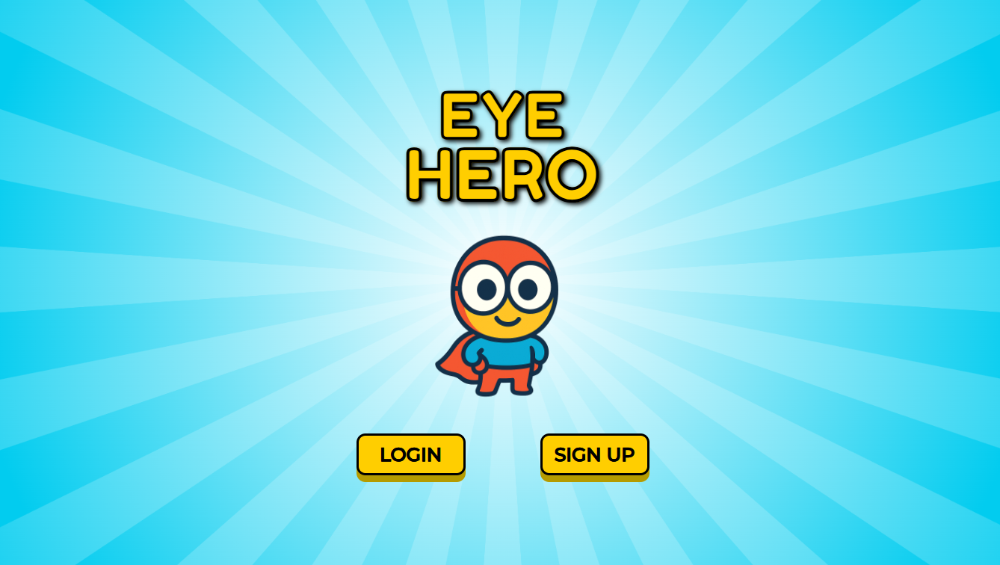

### Signup & Login
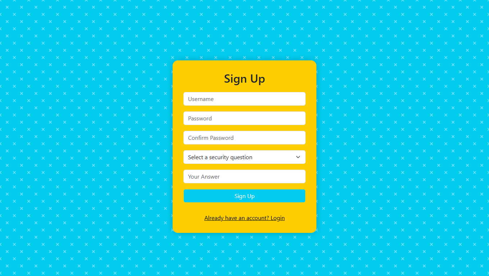
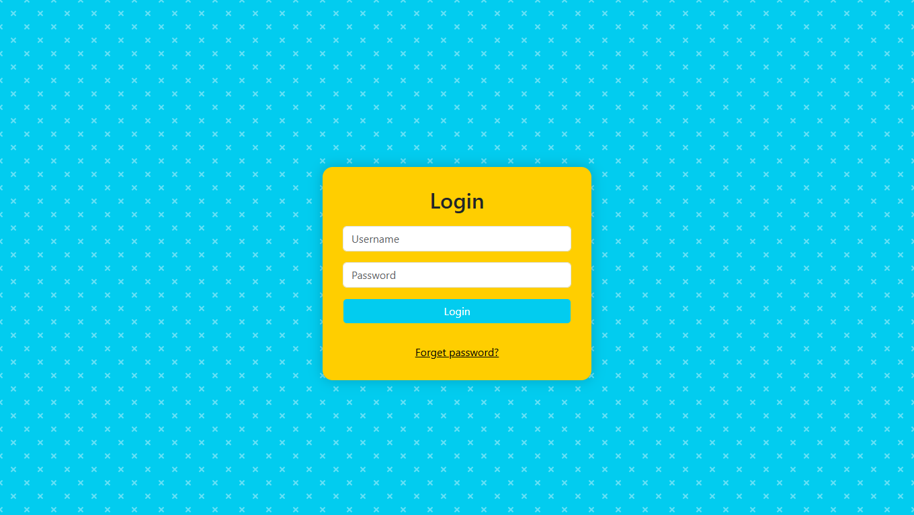

### Forget Password
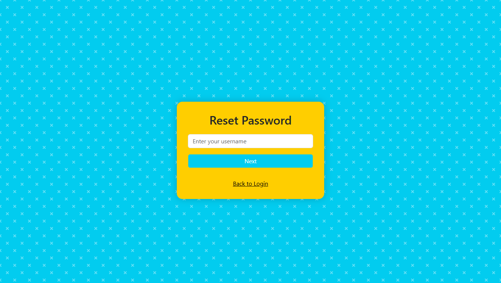
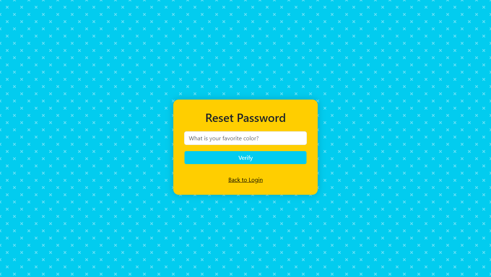
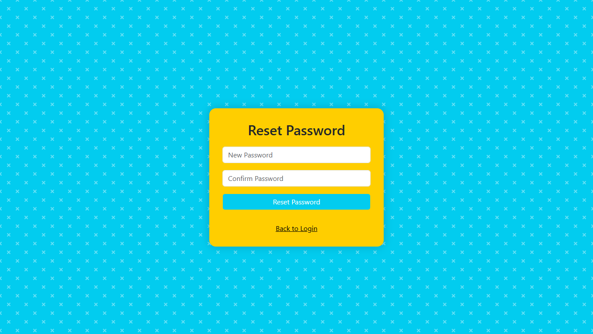

### Home Dashboard


### 20-20-20 Rule
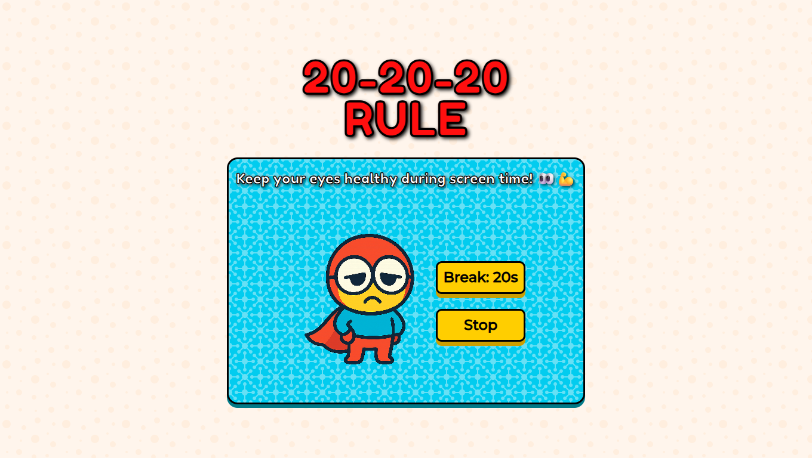
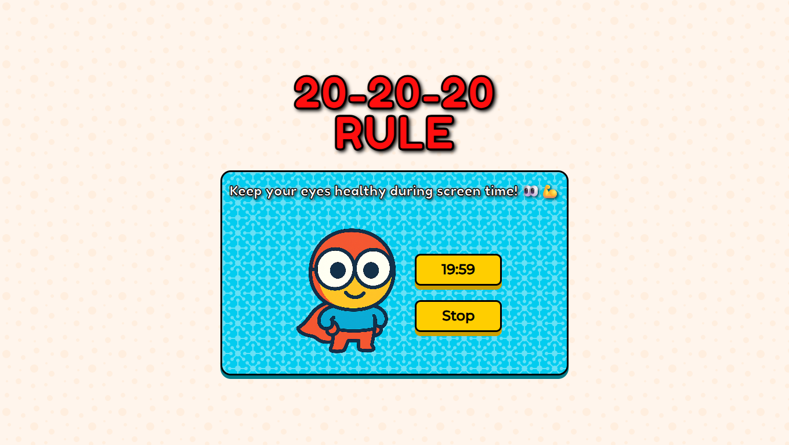

### Morning/Night Exercises

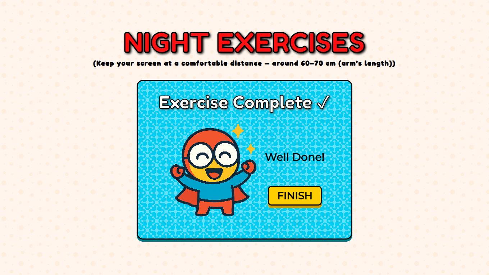

### Progress Tracker
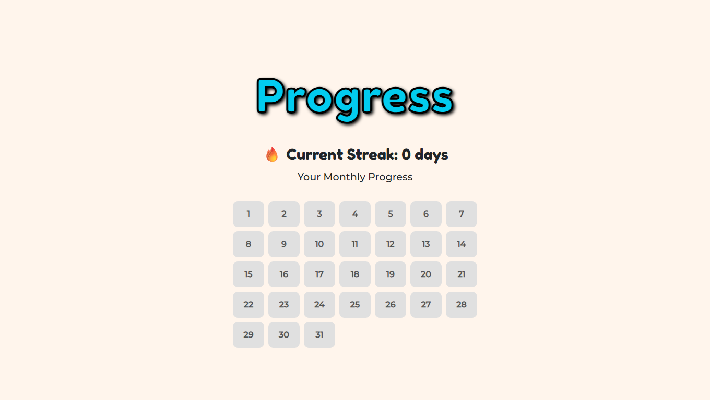
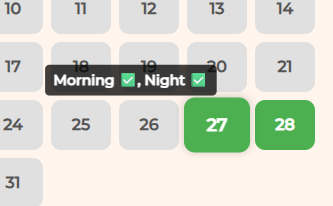
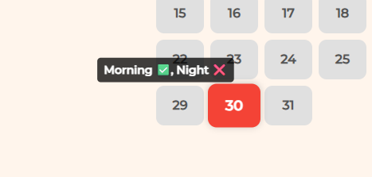
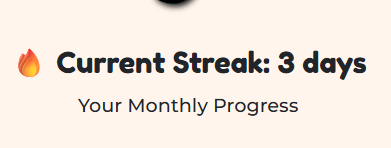

---

## Challenges & References
- Implementing push notifications alongside Flask was new; followed tutorial by Akilesh Rao and ChatGPT guidance.
- `script.js` & `exercises.js` were partially assisted by ChatGPT for timers, notifications, and avatar logic.
- Many components were developed independently during my CS50x journey.

---

## Future Improvements (AI-based)
- **Webcam-based fatigue detection** → detect eye strain or blinking rate and auto-suggest breaks.
- **Smart recommendations** → personalized exercise plans based on consistency and eye strain patterns.
- **Voice-guided exercises** → AI-driven narration for exercises.
- **Predictive analytics** → ML to predict when a user may skip exercises and send proactive reminders.

---

## How to Run Locally
```bash
git clone <https://github.com/Khushbakht-ai/cs50x-2025-progress.git>
cd cs50x-2025-progress/final_project/eyehero

# Set up Python virtual environment
python -m venv venv
# Mac/Linux
source venv/bin/activate
# Windows
venv\Scripts\activate

# Install Python dependencies
pip install -r requirements.txt

# Navigate to Node.js push server
cd static/server
npm init -y
npm install express cors web-push body-parser

# Run Node.js push server
node app.js
# Keep this terminal open for push notifications

# In a new terminal, run Flask backend
cd ../../
flask run
# Open your browser: http://127.0.0.1:5000
```

---

## Final Thoughts
**EyeHero** reflects both my **personal journey** and **CS50 learning path**. Through this project, I applied:

- **Python + Flask** → backend routes and logic
- **SQLite** → persistent database storage
- **HTML, CSS, Bootstrap** → responsive UI design
- **JavaScript** → timers, avatars, and interactivity
- **Push Notifications** (Node.js + Service Worker) → notify users during 20-20-20 breaks to improve engagement

This project taught me how to **take an idea, break it into features, and implement it using CS50 tools**. I’m proud to submit **EyeHero** as my Final Project.

**This was EyeHero!**
